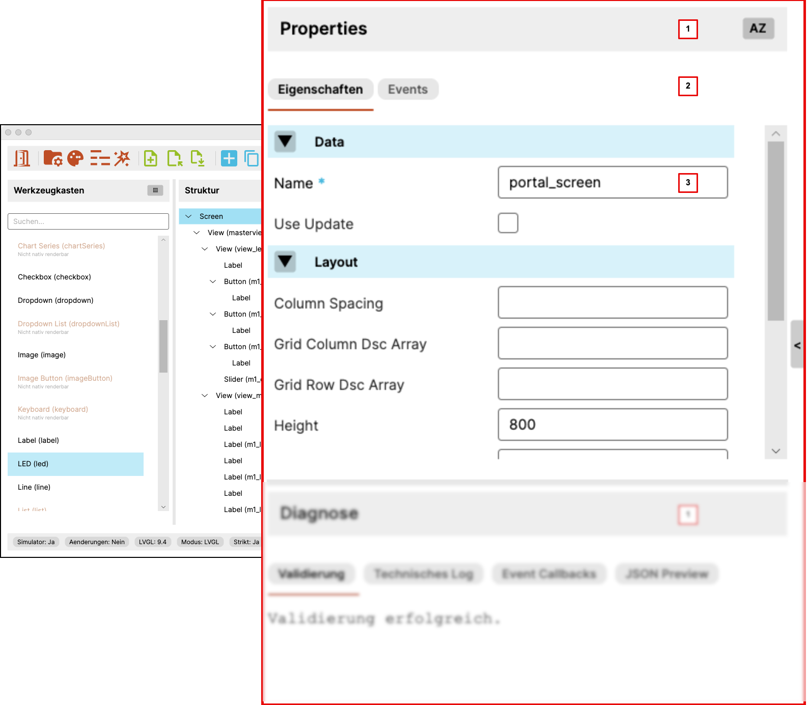

# User Interface: Properties

This chapter describes the properties area of the application.

{ width="760" }

## Purpose of the Properties Area

The properties area shows the attributes of the currently selected element.

It is the central place for editing a widget or container in detail. This is
where you define how an element is structured, which values it carries, and
how it behaves inside the screen.

!!! tip "Tip"
    The properties area becomes most useful after selecting the correct
    element in the structure tree first. That keeps changes focused on the
    intended widget.

## 1. Area Header

The header identifies the property editor as its own work area.

It can also contain controls that influence the presentation or sorting of the
properties.

## 2. Tabs and Groups

The properties area is divided into tabs and property groups.

Typical tabs are:

- `Properties`
- `Events`

Inside these tabs, fields are divided into groups such as `Data` or `Layout`.
This keeps larger sets of attributes manageable.

## MCU-Oriented Technical Properties

The editor deliberately highlights some properties because they are not only
about the visible widget description, but also directly affect generators,
contracts, or MCU integration paths.

These properties are currently highlighted in green and bold:

- `id`
- `useUpdate`
- `callback`
- `action`
- `parameter`
- `eventGroup`
- `eventType`
- `useMessages`

This highlighting means:

- the field is technically relevant for generators or integration paths
- it does not describe only layout, style, or a visible widget value
- it should be maintained consciously and consistently in the project

`id` is explicitly part of this group because it is used as a stable mapping
key for handles, contracts, and updates.

## Meaning of Event Properties for MCU Developers

Especially in the event area, it is important to separate technical and
functional meaning.

In the current state:

- `callback` describes the technical callback assignment
- `eventGroup` groups several events into one shared dispatcher function
- `eventType` distinguishes functional subcases within a group
- `action` describes the main functional meaning of an event
- `parameter` provides a free additional value
- `useMessages` indicates whether the Standard path should prepare a more
  message-oriented custom block

The LVGL trigger such as `clicked` or `released` remains important for
callback registration, but it is no longer treated as the central functional
field for MCU logic. For generated code, `action`, `parameter`, `eventGroup`,
and `eventType` are the more important concepts.

## 3. Editing Fields

The main content of the area is the set of editing controls for the selected
element.

Depending on the widget, this can include:

- text fields
- numeric fields
- selection controls
- boolean toggles

Which properties are visible depends on the selected widget type.

## How It Is Used

In a typical workflow, an element is first selected in the structure tree.
After that, the properties area is used to:

- check general data such as `id`
- adjust layout and size values
- edit widget-specific properties
- add or refine event-related information

That makes the properties area the main place for detailed functional and
technical work on a screen element.

## Level of Support

Not every property is fully implemented for every path yet.

The editor therefore also indicates on property level which values are already
supported reliably and which do not yet fit together completely across preview
and generation.

!!! note "Note"
    The actually available properties always depend on the selected widget type
    and on the current support level of the tool.
