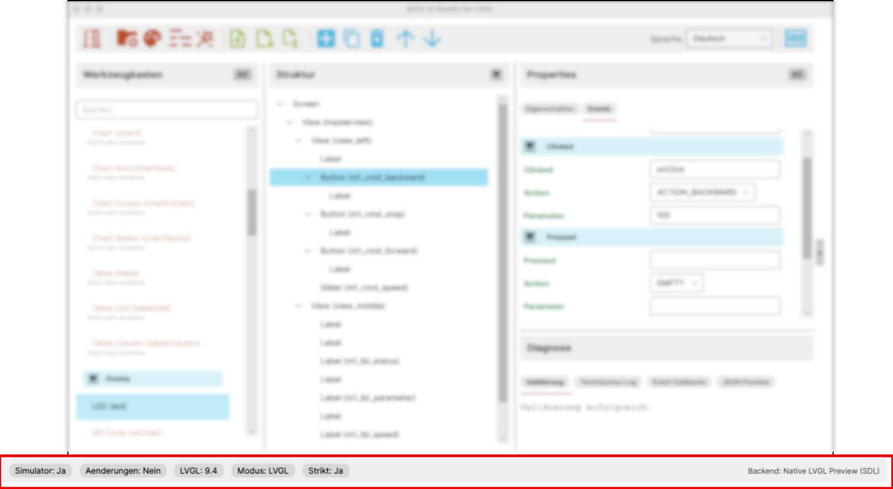

# User Interface: Status Bar

This chapter describes the status bar at the bottom of the application.

## Purpose of the Status Bar

The status bar shows the current technical and editor-related state of the
application in a compact form.

It is not a separate work area, but an ongoing orientation aid. During daily
work it allows you to see quickly whether the editor is connected, modified,
or working in a specific project mode.

## 1. Simulator

The `Simulator` entry shows whether the preview or simulator is currently
connected to the editor.

Typical values are:

- `Yes`
- `No`

This helps estimate quickly whether changes can already be forwarded to a
running preview.

## 2. Changes

The `Changes` entry shows whether unsaved modifications exist since the last
save or load operation.

Typical values are:

- `Yes`
- `No`

This is especially useful when switching between multiple steps or file
operations.

## 3. LVGL

The `LVGL` entry shows the LVGL version configured for the current project.

For example:

- `LVGL: 9.4`

This value belongs to the project context and helps interpret preview,
metamodel, and generation.

## 4. Mode

The `Mode` entry shows the active project mode.

Typical values include:

- `LVGL`
- `LVGL-XML`

The mode affects which generator and runtime paths are active in the project.

## 5. Strict

The `Strict` entry shows whether strict validation is enabled for the project.

Typical values are:

- `Yes`
- `No`

This makes it immediately visible whether the project uses stronger formal
checks.

## 6. Backend

On the far right, the status bar shows the active preview backend.

For example:

- `Backend: Native LVGL Preview (SDL)`

This is useful when multiple preview paths exist or when diagnosis and
comparison depend on knowing which backend is currently active.

## How It Is Used

The status bar is particularly useful for seeing at a glance:

- whether the simulator is connected
- whether unsaved changes exist
- which LVGL version is active
- which mode the project uses
- whether strict validation is enabled
- which preview backend is in use

Especially during project switching, diagnosis, or generator work, this compact
summary is often faster than checking several dialogs or project files.
