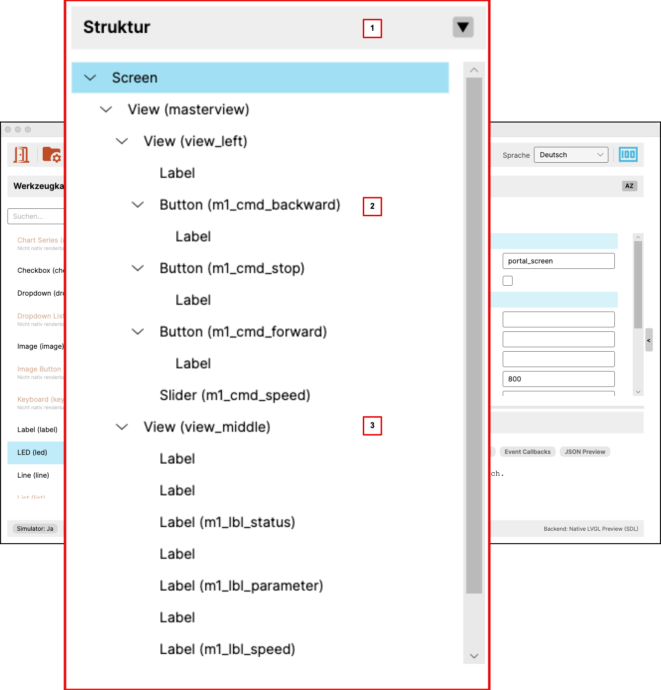

# User Interface: Structure

This chapter describes the structure tree of the current screen.

{ width="520" }

## Purpose of the Structure Tree

The structure tree shows the logical organization of the current screen.

It makes visible:

- which widgets exist
- how they are nested
- which element is currently selected
- how a widget fits into the overall screen hierarchy

The structure tree is therefore the most important view of the internal order
of the screen.

## 1. Area Header

The header identifies the structure tree as its own work area.

It may also contain controls for display or navigation within the structure.

## 2. Selected Element

Inside the tree, one element is marked as the current selection.

This selection matters because it is linked to other parts of the application:

- the properties area shows attributes of the selected element
- the simulator highlights the selected widget
- diagnostics and editing actions refer to that element

## 3. Child Relations and Nesting

The indentation of the tree shows widget hierarchy.

This reveals:

- which widget is a child of another widget
- which containers hold which content
- how a screen is logically built

For more complex screens, this view is often more important than the purely
visual layout.

## 4. Drag and Drop

The structure tree supports drag and drop in two typical forms:

- A widget can be dragged from the toolbox into the structure.
- An existing element can be moved to another position within the structure.

When moving inside the structure, the editor distinguishes between three
insert modes:

- before an element
- as a child of an element
- after an element

This makes it easy to reorganize hierarchies without recreating elements from
scratch.

Not every drop position is valid. The editor respects the parent-child rules
defined in the metamodel and automatically prevents invalid targets.

## How It Is Used

In a typical workflow, the structure tree is used to:

- select an element
- check its position in the hierarchy
- understand its relation to parent and child elements
- and adjust the structure through drag and drop if needed

This makes the structure tree the central view of the internal order of the
screen.
