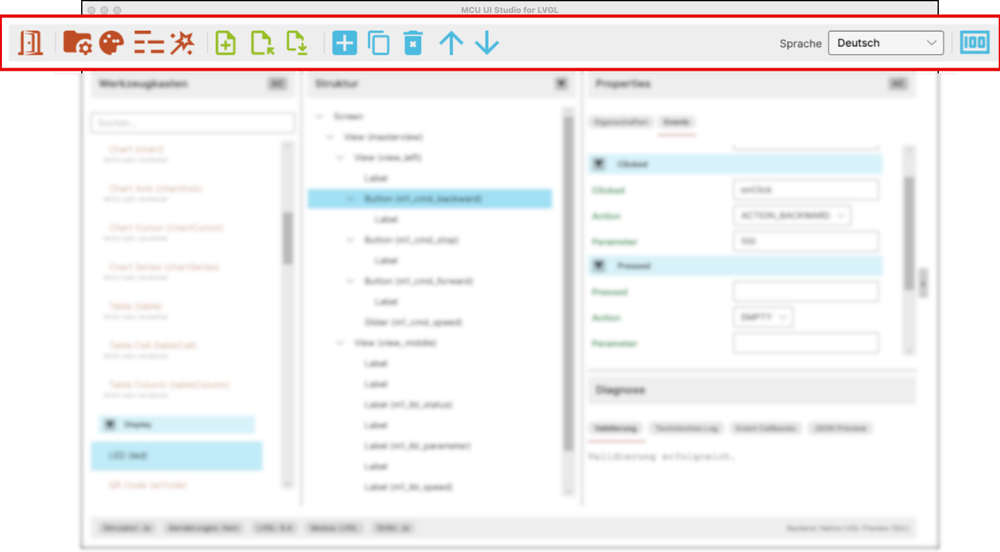

# User Interface: Toolbar

This chapter describes the toolbar in the upper area of the application.

## Purpose of the Toolbar

The toolbar collects the most important direct actions of the application.

It is designed for frequent workflows and provides fast access to functions
that would otherwise require more dialogs or intermediate steps.

The toolbar is roughly divided into several functional blocks:

- application and project context
- screen files
- editing of the selected element
- language
- preview helpers

## 1. Application and Project Context

The left section contains the more global functions:

- `Exit`
  Closes the application.
- `Project`
  Opens the project dialog for project path, output paths, template, and other
  project-specific settings.
- `Theme`
  Opens the theme dialog for `theme_project.c`.
- `lv_conf`
  Opens the dialog for editing the project-specific `lv_conf`.
- `Generate Code`
  Starts MCU code generation for the current project.

This group affects the overall project context rather than only the currently
open screen.

## 2. Screen Files

The next block is for direct work with screen files:

- `New`
  Creates a new screen or screen file.
- `Open`
  Opens an existing screen file from the project.
- `Save`
  Saves the current state of the open screen file.

This block is especially important for the ongoing editing flow because it
keeps creation, loading, and saving readily available.

## 3. Structure and Element Editing

The next group contains direct editing actions for the currently selected
element:

- `Add Element`
  Inserts the currently selected toolbox widget at the selected position in the
  structure.
- `Duplicate`
  Creates a copy of the selected element.
- `Delete`
  Removes the selected element from the structure.
- `Move Up`
  Moves the selected element one position upward in the hierarchy.
- `Move Down`
  Moves the selected element one position downward in the hierarchy.

This group works closely together with the toolbox and the structure tree. It
is especially useful when editing should happen through explicit actions rather
than drag and drop.

## 4. Language

On the right side of the toolbar, the current UI language can be changed.

This allows direct switching without opening a separate settings dialog.

## 5. Preview Help

On the far right there is currently an additional quick action for the
preview:

- `Reset preview to original size`

This helps restore a clear base state when size or zoom have been changed.

## How It Is Used

The toolbar is not meant to replace the rest of the editor. It is a fast
access layer for recurring actions.

It complements:

- the toolbox
- the structure tree
- the properties area
- the dialogs for project, theme, and `lv_conf`

That makes many standard actions available directly without detours.
