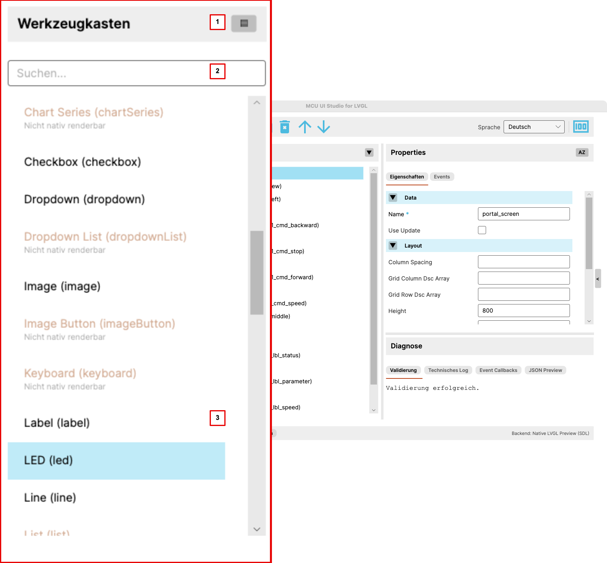

# User Interface: Toolbox

This chapter describes the toolbox on the left side of the application.

{ width="520" }

## Purpose of the Toolbox

The toolbox is where the widgets available in the current context are shown.

It is the actual starting point for building a screen:

- choose widgets
- insert them into the screen or into a suitable container
- narrow the available list based on context

## 1. Area Header and Sorting

The toolbox header contains the title of the area and the sorting switch.

Depending on the setting, the toolbox can be arranged differently, for example
grouped or alphabetically. This allows the view to fit different working
styles.

## 2. Search Field

Below the header is the search field.

It helps narrow the visible widget list quickly. This is especially useful for
larger widget sets when you are looking for one specific element.

## 3. Widget List

The main part of the toolbox is the widget list itself.

The editor shows:

- which widgets are allowed in the current context
- what they are called
- and whether they are already fully supported

Not-yet-fully-supported widgets are marked deliberately, so it stays visible
which elements already fit together reliably across editor, simulator, and
display path.

## How It Is Used

In a typical workflow, a widget is chosen in the toolbox and then inserted
into the screen.

After that it appears in the structure tree and can be edited further there.
That makes the toolbox the starting point of actual screen construction.
