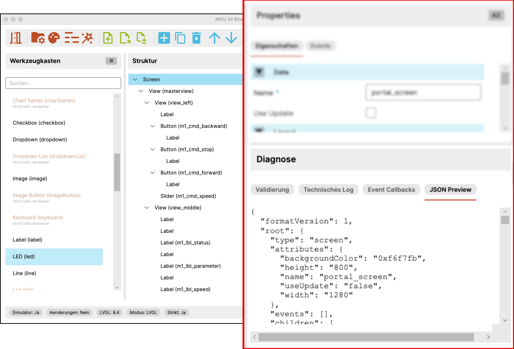

# Benutzeroberfläche: Diagnose

Dieses Kapitel beschreibt den Diagnosebereich im unteren Teil der Anwendung.

{ width="860" }

## Aufgabe des Diagnosebereichs

Der Diagnosebereich bündelt technische Rückmeldungen zum aktuellen Dokument.

Er dient nicht dem Aufbau des Screens selbst, sondern der Kontrolle und
Nachvollziehbarkeit des aktuellen Zustands.

Dadurch ergänzt er die eigentliche Bearbeitung um eine technische Sicht auf
das Projekt.

!!! tip "Tipp"
    Der Diagnosebereich ist besonders nützlich, wenn nach Änderungen unklar
    ist, ob ein Problem aus dem Modell, aus den Event-Angaben oder aus der
    Generierung stammt.

## Diagnose-Tabs

Im Diagnosebereich stehen mehrere Register zur Verfügung. Dazu gehören im
aktuellen Stand insbesondere:

- `Validierung`
- `Technisches Log`
- `Event Callbacks`
- `JSON Preview`

Je nach Fragestellung hilft ein anderer Tab weiter.

## Validierung

Der Tab `Validierung` zeigt Rückmeldungen zur formalen Prüfung des aktuellen
Dokuments.

Hier wird sichtbar, ob das aktuelle Screen-Modell aus Sicht des Editors
konsistent ist oder ob bestimmte Regeln verletzt werden.

## Technisches Log

Das technische Log dient dazu, interne Rückmeldungen und Ablaufhinweise
sichtbar zu machen.

Es ist besonders dann hilfreich, wenn Vorschau, Generierung oder andere
Abläufe nachvollzogen werden sollen.

## Event Callbacks

Dieser Bereich bezieht sich auf Ereignislogik und eventbezogene Ausgaben.

Er ist besonders relevant, wenn Screens nicht nur visuell aufgebaut, sondern
auch mit Callback- oder Ereignisstruktur betrachtet werden.

## JSON Preview

Die JSON-Vorschau zeigt das aktuelle Dokumentmodell in seiner strukturierten
Form.

Dadurch wird sichtbar, wie der aktuelle Screen intern beschrieben ist. Das ist
hilfreich, wenn der Zusammenhang zwischen Editorzustand und Modellstruktur
direkt nachvollzogen werden soll.

## Verwendung im Arbeitsablauf

Der Diagnosebereich wird meist ergänzend genutzt:

- nach Änderungen an einem Screen
- bei der Kontrolle der Modellstruktur
- bei Fehlern oder Inkonsistenzen
- beim Vergleich zwischen Editorzustand und internem Dokumentmodell

Damit ist die Diagnose kein Nebenbereich, sondern ein wichtiges Werkzeug für
Transparenz und technische Kontrolle.

!!! note "Hinweis"
    Die Diagnose ersetzt nicht die eigentliche Zielsystem-Integration. Sie ist
    als frühe Kontroll- und Nachvollziehbarkeitsstufe innerhalb des Editors
    gedacht.
