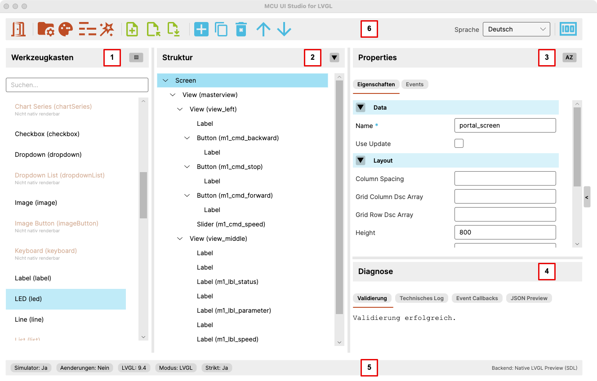

# Benutzeroberfläche — Übersicht

Dieses Kapitel gibt einen Überblick über die wichtigsten Arbeitsbereiche von
MCU UI Studio for LVGL.

Die folgende Abbildung zeigt die Hauptoberfläche des Editors mit den zentralen
Bereichen, die im normalen Arbeitsablauf eine Rolle spielen.

## 1. Werkzeugkasten

Der Werkzeugkasten enthält die im aktuellen Kontext verfügbaren Widgets.

Von hier aus werden neue Elemente in den Screen eingefügt. Zusätzlich macht
der Werkzeugkasten sichtbar, welche Widgets im aktuellen Stand bereits
unterstützt sind und welche noch nicht vollständig im Preview- und
Displaypfad umgesetzt wurden.

Je nach Sortierung und Kontext werden die Einträge gruppiert oder alphabetisch
angezeigt.

## 2. Struktur

Der Strukturbaum zeigt den aktuellen Aufbau des Screens.

Hier ist sichtbar:

- welche Widgets auf dem Screen vorhanden sind
- wie Container und Unterelemente verschachtelt sind
- welches Element aktuell ausgewählt ist

Der Strukturbaum ist die zentrale Arbeitsansicht für den logischen Aufbau des
Screens.

## 3. Properties

Im Property-Bereich werden die Eigenschaften des aktuell markierten Elements
bearbeitet.

Dazu gehören insbesondere:

- allgemeine Daten wie `id`
- Layout- und Größenangaben
- widget-spezifische Eigenschaften
- Event-bezogene Angaben

Je nach Elementtyp unterscheiden sich die verfügbaren Eigenschaften. Nicht
vollständig unterstützte Properties werden im Editor kenntlich gemacht.

## 4. Diagnose

Der Diagnosebereich fasst technische Rückmeldungen zum aktuellen Dokument
zusammen.

Dazu gehören unter anderem:

- Validierung
- technisches Log
- Event-Callbacks
- JSON-Vorschau

Dieser Bereich hilft dabei, Fehler, Inkonsistenzen und den internen Zustand
des aktuellen Screens schneller nachzuvollziehen.

## 5. Statusleiste

Die Statusleiste am unteren Rand zeigt den aktuellen Arbeitszustand der
Anwendung in kompakter Form.

Dazu gehören je nach Situation zum Beispiel:

- ob ein Simulator aktiv ist
- ob ungespeicherte Änderungen vorliegen
- welche LVGL-Version verwendet wird
- welcher Modus aktiv ist
- welcher Preview-Backendpfad genutzt wird

Sie dient damit als schnelle technische Einordnung des aktuellen Zustands.

## 6. Toolbar

Die Toolbar am oberen Rand bündelt die wichtigsten Aktionen der Anwendung.

Dazu gehören insbesondere:

- Projekt öffnen oder anlegen
- Theme- und `lv_conf`-Bearbeitung
- Screen-Datei anlegen, laden und speichern
- Code-Generierung
- Navigation und Bearbeitung im Strukturkontext
- Sprachumschaltung

Die Toolbar ist auf kurze, häufig genutzte Arbeitswege ausgelegt und bildet
den schnellsten Einstieg in die wichtigsten Aktionen des Editors.

## Arbeitsweise der Oberfläche

Die Hauptoberfläche ist so aufgebaut, dass Struktur, Eigenschaften und
technische Rückmeldung parallel sichtbar bleiben.

Dadurch muss beim Arbeiten nicht ständig zwischen verschiedenen Dialogen oder
Ansichten gewechselt werden. Der Screen-Aufbau, die Bearbeitung des aktuell
gewählten Elements und die Diagnose des Ergebnisses bleiben im Zusammenhang
sichtbar.
